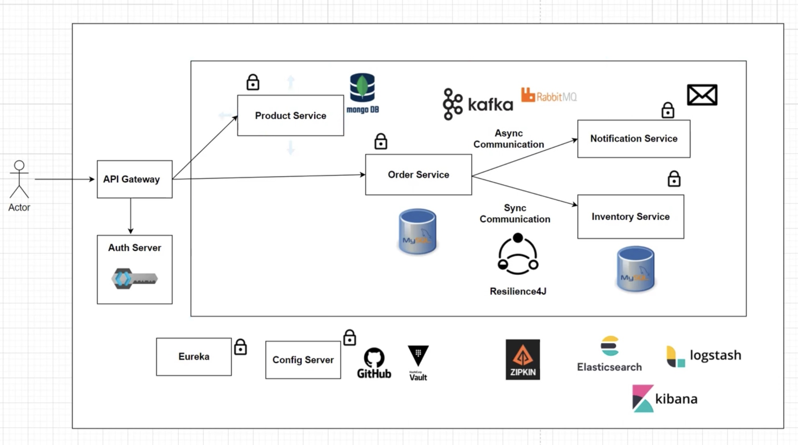

# Project Architecture Overview

This project consists of multiple microservices that interact with each other through synchronous and asynchronous communication. Below is the detailed architecture of the system:

## Components

1. **API Gateway**
    - Acts as the single entry point for all client requests.
    - Routes requests to appropriate microservices.
    - Secures endpoints and handles authentication.

2. **Auth Server**
    - Manages user authentication and issues JWT tokens.
    - Integrated with the API Gateway for securing microservice endpoints.

3. **Eureka Server**
    - Service discovery server where all microservices register themselves.
    - Allows dynamic service lookup and helps with load balancing.

4. **Config Server**
    - Centralized configuration management for all microservices.
    - Stores configuration properties in a version-controlled system like GitHub.

5. **Product Service**
    - Manages creation and viewing of products.
    - Acts as the product catalog.
    - Uses MongoDB for data storage.

6. **Order Service**
    - Handles order processing and management.
    - Communicates with Product Service to fetch product details.
    - Uses MySQL for data storage.
    - Utilizes Resilience4J for fault tolerance and resilience.

7. **Inventory Service**
    - Checks the stock availability of products.
    - Communicates synchronously with the Order Service.
    - Uses MySQL for data storage.

8. **Notification Service**
    - Sends notifications after an order is placed.
    - Communicates asynchronously with the Order Service using Kafka or RabbitMQ.

## Communication Types

- **Synchronous Communication**
    - Direct, real-time communication between Order Service and Inventory Service.

- **Asynchronous Communication**
    - Event-driven communication between Order Service and Notification Service using message brokers like Kafka or RabbitMQ.

## Additional Tools

- **Zipkin**
    - Distributed tracing for monitoring and troubleshooting microservices.

- **Elasticsearch, Logstash, Kibana (ELK Stack)**
    - Centralized logging and monitoring solution.
    - Collects, processes, and visualizes log data from all microservices.

- **Vault**
    - Securely stores and manages sensitive information such as API keys and secrets.

By following this architecture, we ensure a scalable, resilient, and maintainable microservices ecosystem.
