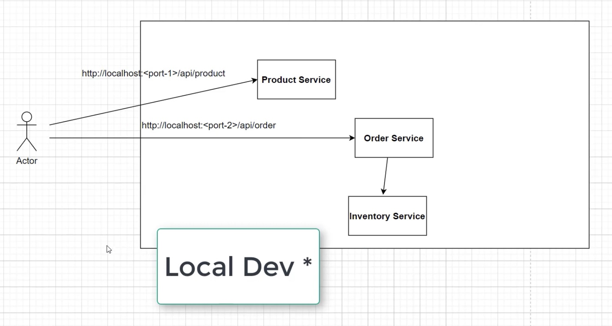
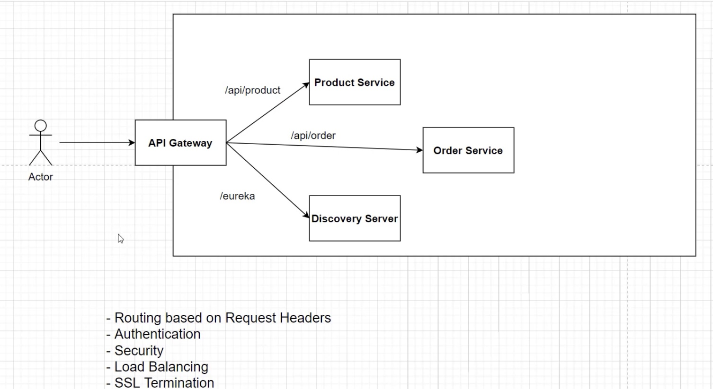

# Need for an API Gateway in Microservices Architecture

In a microservices architecture, services are designed to be fine-grained and the number of services can grow rapidly. Managing these services and their interactions with clients can become complex. This is where an API Gateway comes into play.

## Why is there a Need for an API Gateway?

Without an API Gateway, clients must communicate directly with individual microservices. This approach has several challenges:

- **Complexity for Clients**: Clients need to know the addresses of all the services and handle communication with each one. This increases the complexity on the client-side.
- **Inconsistent Interfaces**: Different services may have different communication protocols and interfaces, leading to inconsistency and difficulty in client-side development.
- **Cross-Cutting Concerns**: Features like authentication, logging, rate limiting, and monitoring must be implemented in each service separately, leading to code duplication.
- **Lack of Centralized Control**: Without a central entry point, it is difficult to manage and control the flow of requests, apply security policies, and monitor traffic.

### Local Development Example

In a local development setup, clients directly interact with individual services using their specific endpoints.

In this setup, the client needs to know the specific ports and endpoints for each service:
- `http://localhost:<port-1>/api/product` for Product Service
- `http://localhost:<port-2>/api/order` for Order Service

This direct interaction leads to several issues as mentioned above.

## How an API Gateway Helps with Microservices

An API Gateway acts as a single entry point for all client requests. It abstracts the complexity of multiple services and provides a unified interface for clients. Here's how an API Gateway helps:

- **Single Entry Point**: Clients interact with the API Gateway instead of individual services. The gateway handles routing to the appropriate service.
- **Load Balancing**: The API Gateway can distribute incoming requests across multiple instances of a service to ensure even load distribution.
- **Security**: Centralized handling of authentication and authorization. The API Gateway can enforce security policies before forwarding requests to services.
- **Protocol Translation**: The API Gateway can translate between different protocols (e.g., HTTP to WebSocket) if necessary.
- **Centralized Logging and Monitoring**: The API Gateway can collect and aggregate logs and metrics for all incoming and outgoing traffic, providing a centralized point for monitoring.
- **Handling Cross-Cutting Concerns**: Features like rate limiting, caching, and request transformation can be handled centrally by the API Gateway, reducing the burden on individual services.

### API Gateway Example

In a microservices architecture with an API Gateway, clients interact with the gateway, which then routes requests to the appropriate services.

In this setup, the client only needs to know the endpoint of the API Gateway:
- `/api/product` for Product Service
- `/api/order` for Order Service
- `/eureka` for Discovery Server

The API Gateway handles:
- **Routing based on Request Headers**
- **Authentication**
- **Security**
- **Load Balancing**
- **SSL Termination**

### Advantages of Using an API Gateway

1. **Simplified Client Interface**: Clients only need to interact with a single endpoint, reducing complexity.
2. **Centralized Security**: Security policies can be enforced consistently across all services.
3. **Efficient Load Balancing**: The gateway can efficiently distribute requests to prevent overloading any single service instance.
4. **Enhanced Monitoring**: Centralized logging and metrics collection provide better insights into the system’s performance and health.
5. **Improved Scalability**: Services can be scaled independently behind the gateway without affecting the client.

## Conclusion

An API Gateway is an essential component in a microservices architecture, providing a unified entry point for clients and simplifying the management of multiple services. It helps in addressing various challenges such as security, load balancing, and monitoring, thereby enhancing the overall efficiency and scalability of the system.

By using an API Gateway, you can ensure that your microservices architecture remains manageable, secure, and performant as it grows.