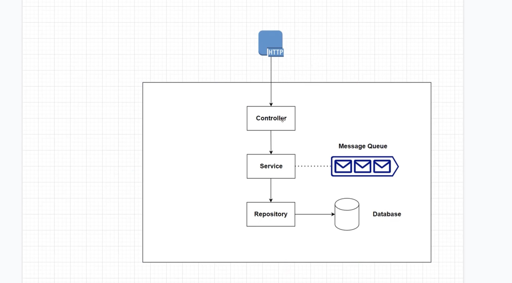

# Layered Service Architecture

Layered architecture is a common architectural pattern used to separate concerns within an application. This pattern divides the application into layers, each responsible for a specific aspect of the application's functionality. The following documentation explains the different layers in a typical service architecture, as depicted in the diagram below.

## Layers in the Service Architecture

### 1. Controller Layer

- **Role**: The Controller layer is responsible for handling HTTP requests from clients. It acts as an interface between the client and the service layer.
- **Responsibilities**:
    - Receive and process incoming HTTP requests.
    - Validate request data.
    - Call the appropriate service methods.
    - Return the appropriate HTTP responses.

### 2. Service Layer

- **Role**: The Service layer contains the business logic of the application. It acts as a mediator between the Controller layer and the Repository layer.
- **Responsibilities**:
    - Implement business rules and logic.
    - Coordinate between different parts of the application.
    - Call repository methods to interact with the database.
    - Interact with other services or components, such as message queues.

### 3. Repository Layer

- **Role**: The Repository layer is responsible for data access. It interacts directly with the database to perform CRUD (Create, Read, Update, Delete) operations.
- **Responsibilities**:
    - Execute database queries.
    - Return data to the service layer.
    - Map database entities to domain objects.

### 4. Message Queue

- **Role**: Message queues are used to enable asynchronous communication between different parts of the application or between different services.
- **Responsibilities**:
    - Temporarily store messages that are sent from the service layer.
    - Ensure messages are delivered to their intended recipients.
    - Enable decoupling of services, allowing them to communicate without needing to be directly connected.

### 5. Database

- **Role**: The Database layer is responsible for persisting data. It stores the application's data in a structured format.
- **Responsibilities**:
    - Store and retrieve data as requested by the repository layer.
    - Ensure data integrity and consistency.
    - Provide mechanisms for data indexing and querying.

## How it Works

1. **HTTP Request**: A client sends an HTTP request to the Controller.
2. **Controller Processing**: The Controller processes the request, validates the data, and calls the appropriate method in the Service layer.
3. **Service Logic**: The Service layer executes the business logic. It may call the Repository layer to interact with the database or send messages to a message queue.
4. **Repository Access**: If the Service layer requires data from the database, it calls the appropriate method in the Repository layer, which interacts with the database to fetch or store data.
5. **Message Queue**: For asynchronous operations, the Service layer sends messages to a message queue. These messages can be processed by other services or components at a later time.
6. **Database Operations**: The Repository layer performs the necessary database operations and returns the results to the Service layer.
7. **HTTP Response**: The Service layer processes the results and the Controller sends the appropriate HTTP response back to the client.

## Benefits of Layered Architecture

- **Separation of Concerns**: Each layer has a specific responsibility, making the system easier to understand and maintain.
- **Modularity**: Layers can be developed, tested, and maintained independently.
- **Reusability**: Common functionality can be reused across different parts of the application.
- **Scalability**: Layers can be scaled independently based on their specific needs.

By following a layered service architecture, you can build scalable, maintainable, and testable applications. This approach helps in organizing code effectively, promoting reusability, and enhancing the overall structure of the application.
