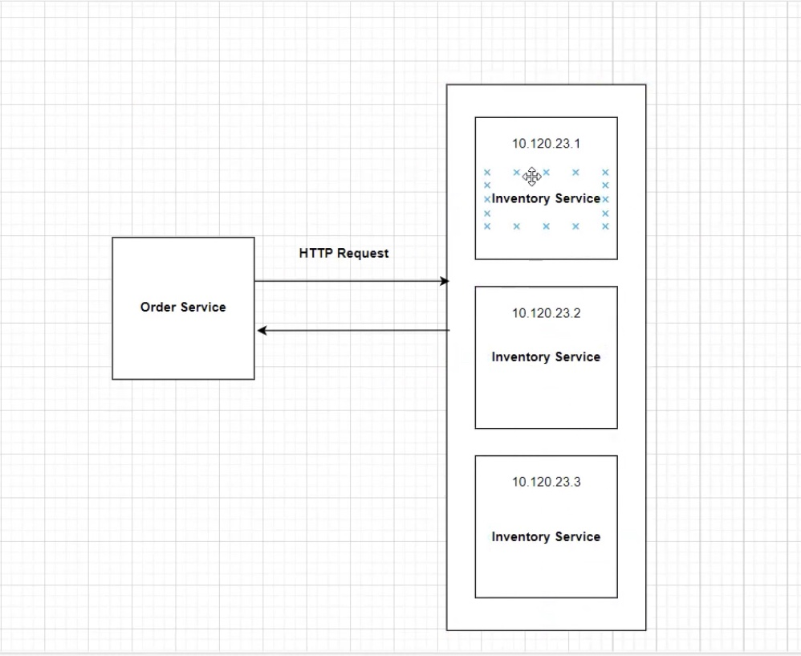
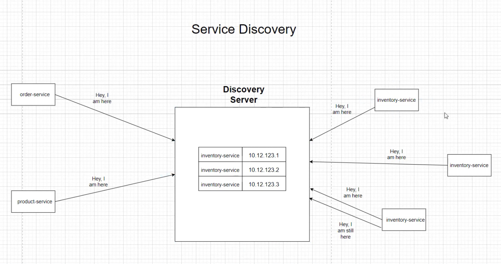
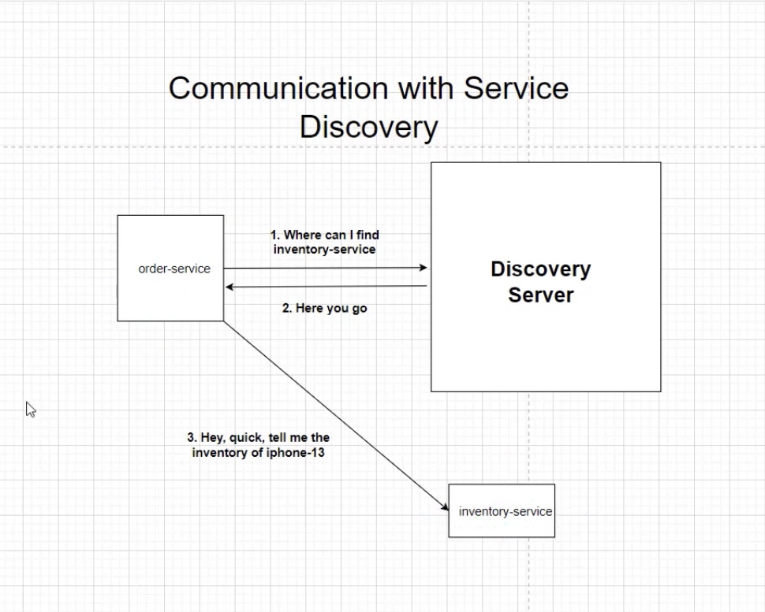
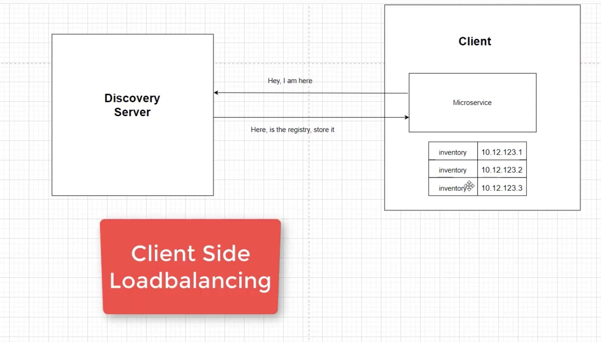

# Service Discovery in Microservices

## Need for Service Discovery

In a microservices architecture, services need to communicate with each other. Without a service discovery mechanism, it would be challenging to manage and locate these services, especially as the number of services and instances grows. Service discovery solves this problem by dynamically maintaining a registry of service instances and their locations.



## Using Eureka Server as Service Discovery in Spring Boot

Eureka Server, part of the Netflix OSS stack, is a service registry that provides service discovery. In Spring Boot, integrating Eureka is straightforward with Spring Cloud Netflix.

### Setting Up Eureka Server

1. Add the dependency in the `pom.xml`:

    ```xml
    <dependency>
        <groupId>org.springframework.cloud</groupId>
        <artifactId>spring-cloud-starter-netflix-eureka-server</artifactId>
    </dependency>
    ```

2. Enable Eureka Server in the main application class:

    ```java
    @SpringBootApplication
    @EnableEurekaServer
    public class DiscoveryServerApplication {
        public static void main(String[] args) {
            SpringApplication.run(DiscoveryServerApplication.class, args);
        }
    }
    ```

3. Configure `application.yml`:

    ```yaml
    server:
      port: 8761

    eureka:
      client:
        register-with-eureka: false
        fetch-registry: false
      server:
        enable-self-preservation: false
    ```

### Setting Up Eureka Clients

1. Add the dependency in the `pom.xml` of each microservice:

    ```xml
    <dependency>
        <groupId>org.springframework.cloud</groupId>
        <artifactId>spring-cloud-starter-netflix-eureka-client</artifactId>
    </dependency>
    ```

2. Enable Eureka Client in the main application class:

    ```java
    @SpringBootApplication
    @EnableEurekaClient
    public class ServiceApplication {
        public static void main(String[] args) {
            SpringApplication.run(ServiceApplication.class, args);
        }
    }
    ```

3. Configure `application.yml` for each service:

    ```yaml
    eureka:
      client:
        serviceUrl:
          defaultZone: http://localhost:8761/eureka/
    ```



## Communication with Service Discovery

Microservices use the service discovery to locate and communicate with other services. This is typically done via HTTP requests where the client service queries the discovery server to get the address of the target service.



### Steps in Service Communication

1. The client service (e.g., `order-service`) queries the discovery server to find the instances of the target service (e.g., `inventory-service`).
2. The discovery server responds with the addresses of the available instances.
3. The client service then communicates with one of the instances.

## Client-Side Copy of Service Registry

To enhance performance and resilience, clients can maintain a local copy of the service registry. This allows the client to make quicker decisions and continue to operate even if the discovery server is temporarily unavailable.



## Load Balancing with Multiple Instances

When there are multiple instances of a service, load balancing is crucial to distribute the requests evenly. Client-side load balancing, often implemented with libraries like Ribbon, helps in distributing the load by selecting instances based on various strategies (e.g., round-robin, random).

### Example

1. The discovery server maintains a list of all instances of a service.
2. The client uses this list to distribute requests among the available instances.

## Handling Failures

### Eureka Server Down

If the Eureka server goes down, clients can still use their local cache of the service registry to continue operation. However, new services will not be able to register, and changes in the network topology will not be updated until the Eureka server is back online.

### Service Instance Down

If a service instance goes down, the Eureka server will eventually mark it as unavailable and remove it from the registry. Clients using the service registry will stop sending requests to the downed instance. Load balancing mechanisms also help in retrying requests with other available instances.

## Conclusion

Service discovery is a critical component in a microservices architecture, providing dynamic discovery and load balancing capabilities. Eureka, part of the Spring Cloud Netflix stack, is a powerful tool for implementing service discovery in Spring Boot applications. By understanding and utilizing these concepts, you can build robust and scalable microservices architectures.