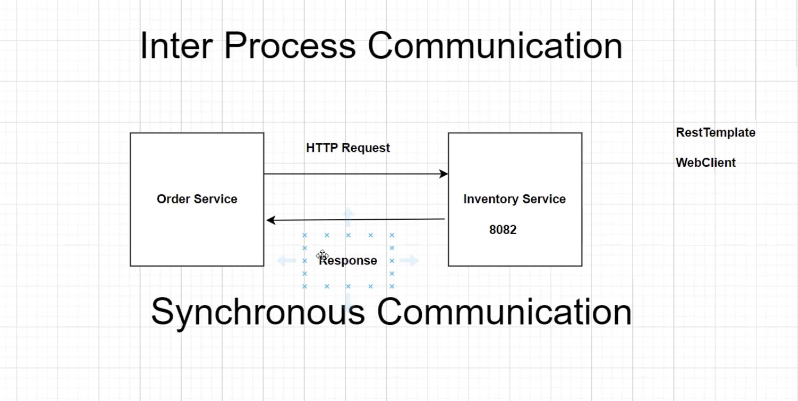

# Synchronous Communication Between Microservices

Synchronous communication in microservices involves direct interaction between services through HTTP requests. This type of communication is often required when one service needs an immediate response from another to proceed with its logic.

## Why is there a Need for Synchronous Communication?

Synchronous communication is necessary in scenarios where one service must wait for a response from another service before continuing its process. This is typically needed for operations that are dependent on real-time data or for ensuring consistency in business workflows.

## How to Implement Synchronous Communication in Spring Boot

### Using RestTemplate

RestTemplate is a synchronous client to perform HTTP requests, exposing a simple, template method API over underlying HTTP client libraries such as the JDK HttpURLConnection, Apache HttpComponents, and others.

#### Example:

```java
@Service
public class OrderService {

    private final RestTemplate restTemplate;

    @Autowired
    public OrderService(RestTemplateBuilder builder) {
        this.restTemplate = builder.build();
    }

    public InventoryResponse checkInventory(String productId) {
        String url = "http://localhost:8082/api/inventory/{productId}";
        ResponseEntity<InventoryResponse> response = restTemplate.getForEntity(url, InventoryResponse.class, productId);
        return response.getBody();
    }
}
```

### Using WebClient

WebClient is a non-blocking, reactive client for performing HTTP requests with Reactive Streams back pressure. It is part of the Spring WebFlux module.

#### Example:

```java
@Service
public class OrderService {

    private final WebClient webClient;

    @Autowired
    public OrderService(WebClient.Builder webClientBuilder) {
        this.webClient = webClientBuilder.baseUrl("http://localhost:8082").build();
    }

    public Mono<InventoryResponse> checkInventory(String productId) {
        return webClient.get()
                        .uri("/api/inventory/{productId}", productId)
                        .retrieve()
                        .bodyToMono(InventoryResponse.class);
    }
}
```

### Using OpenFeign

OpenFeign is a declarative web service client. It makes writing web service clients easier by providing a simple, declarative API.

#### Example:

1. Add the dependency in `pom.xml`:

    ```xml
    <dependency>
        <groupId>org.springframework.cloud</groupId>
        <artifactId>spring-cloud-starter-openfeign</artifactId>
    </dependency>
    ```

2. Create a Feign client interface:

    ```java
    @FeignClient(name = "inventory-service", url = "http://localhost:8082")
    public interface InventoryClient {

        @GetMapping("/api/inventory/{productId}")
        InventoryResponse checkInventory(@PathVariable("productId") String productId);
    }
    ```

3. Use the Feign client in your service:

    ```java
    @Service
    public class OrderService {

        private final InventoryClient inventoryClient;

        @Autowired
        public OrderService(InventoryClient inventoryClient) {
            this.inventoryClient = inventoryClient;
        }

        public InventoryResponse checkInventory(String productId) {
            return inventoryClient.checkInventory(productId);
        }
    }
    ```

## When to Avoid Synchronous Communication

Synchronous communication should be avoided in scenarios where:

- **High Latency**: The calling service must wait for the response, which can lead to increased latency.
- **Reliability Concerns**: If the target service is down or slow, it directly impacts the calling service, leading to potential cascading failures.
- **Scalability Issues**: Synchronous calls can limit the scalability of the system as services are tightly coupled and dependent on each other’s availability and response times.

## Example of Synchronous Communication



In the provided image, the Order Service communicates synchronously with the Inventory Service using an HTTP request. The Inventory Service responds back to the Order Service, completing the synchronous communication cycle.

- **HTTP Request**: The Order Service sends an HTTP request to the Inventory Service.
- **Response**: The Inventory Service processes the request and sends a response back to the Order Service.

## Conclusion

Synchronous communication is essential in microservices architecture for operations that require immediate response and real-time data consistency. However, it should be used judiciously, considering the trade-offs in latency, reliability, and scalability. Asynchronous communication patterns, like messaging queues or event-driven approaches, can be considered as alternatives to mitigate some of the drawbacks associated with synchronous calls.
